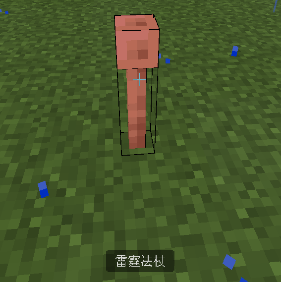
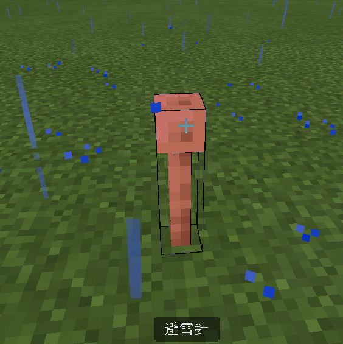

<div align="center">

# 🟦 To Bedrock

[](https://github.com/KAIYOHUGO/to-bedrock/blob/master/LICENSE) [](https://github.com/KAIYOHUGO/to-bedrock/releases) [](https://mcpedl.com/java-translation-for-bedrock/) [](https://hanadigital.github.io/grev/?user=KAIYOHUGO&repo=to-bedrock) [](https://github.com/KAIYOHUGO/to-bedrock/stargazers)


_java translation for bedrock_

</div>

---


> **Warning**
> I am busy on prepare college entrance exam.
> If you can't find 1.20 addon, please [Open Issue](https://github.com/KAIYOHUGO/to-bedrock/issues)

<div align="center">

# ✨ Feature

</div>

this is a tool that will make bedrock version translate be the same as java version translate

Before (it in English means Thunder wand) | After (it in English means lightning rod)
-|-
 | 

<div align="center">

# ❓ How To Use

</div>

1. Go to [latest releases](https://github.com/KAIYOHUGO/to-bedrock/releases/latest/)
2. Download To_Bedrock.mcpack
    
3. Execute addone file
4. Make it active in minecraft

<div align="center">

# Support Language

🧪: Experiment, ✅: Supported
</div>

Lang ID|Lang Name|Support State
-|:-:|:-:
|af_ZA|Afrikaans (Suid-Afrika)|🧪|
|ar_SA|العربية (العالم العربي)|🧪|
|ast_ES|Asturianu (Asturies)|🧪|
|az_AZ|Azərbaycanca (Azərbaycan)|🧪|
|ba_RU|Башҡортса (Рәсәй)|🧪|
|bar|Boarisch (Bayern)|🧪|
|be_BY|Беларуская (Беларусь)|🧪|
|bg_BG|Български (България)|✅|
|br_FR|Brezhoneg (Breizh)|🧪|
|brb|Braobans (Braobant)|🧪|
|bs_BA|Bosanski (Bosna i Hercegovina)|🧪|
|ca_ES|Català (Catalunya)|🧪|
|cs_CZ|Čeština (Česko)|✅|
|cy_GB|Cymraeg (Cymru)|🧪|
|da_DK|Dansk (Danmark)|✅|
|de_AT|Deitsch (Österreich)|🧪|
|de_CH|Schwiizerdütsch (Schwiiz)|🧪|
|de_DE|Deutsch (Deutschland)|✅|
|el_GR|Ελληνικά (Ελλάδα)|✅|
|en_AU|English (Australia)|🧪|
|en_CA|English (Canada)|🧪|
|en_GB|English (United Kingdom)|✅|
|en_NZ|English (New Zealand)|🧪|
|en_PT|Pirate Speak (The Seven Seas)|🧪|
|en_UD|ɥsᴉꞁᵷuƎ (uʍoᗡ ǝpᴉsd∩)|🧪|
|enp|Anglish (Foroned Kingdom)|🧪|
|enws|Shakespearean English (Kingdom of England)|🧪|
|eo_UY|Esperanto (Esperantujo)|🧪|
|es_AR|Español (Argentina)|🧪|
|es_CL|Español (Chile)|🧪|
|es_EC|Español (Ecuador)|🧪|
|es_ES|Español (España)|✅|
|es_MX|Español (México)|✅|
|es_UY|Español (Uruguay)|🧪|
|es_VE|Español (Venezuela)|🧪|
|esan|Andalûh (Andaluçía)|🧪|
|et_EE|Eesti keel (Eesti)|🧪|
|eu_ES|Euskara (Euskal Herria)|🧪|
|fa_IR|فارسی (ايران)|🧪|
|fi_FI|Suomi (Suomi)|✅|
|fil_PH|Filipino (Pilipinas)|🧪|
|fo_FO|Føroyskt (Føroyar)|🧪|
|fr_CA|Français (Canada)|✅|
|fr_FR|Français (France)|✅|
|fra_DE|Fränggisch (Franggn)|🧪|
|fur_IT|Furlan (Friûl)|🧪|
|fy_NL|Frysk (Fryslân)|🧪|
|ga_IE|Gaeilge (Éire)|🧪|
|gd_GB|Gàidhlig (Alba)|🧪|
|gl_ES|Galego (Galicia / Galiza)|🧪|
|haw_US|ʻŌlelo Hawaiʻi (Hawaiʻi)|🧪|
|he_IL|עברית (ישראל)|🧪|
|hi_IN|हिंदी (भारत)|🧪|
|hr_HR|Hrvatski (Hrvatska)|🧪|
|hu_HU|Magyar (Magyarország)|✅|
|hy_AM|Հայերեն (Հայաստան)|🧪|
|id_ID|Bahasa Indonesia (Indonesia)|✅|
|ig_NG|Igbo (Naigeria)|🧪|
|io_EN|Ido (Idia)|🧪|
|is_IS|Íslenska (Ísland)|🧪|
|isv|Medžuslovjansky (Slovjanščina)|🧪|
|it_IT|Italiano (Italia)|✅|
|ja_JP|日本語 (日本)|✅|
|jbo_EN|la .lojban. (la jbogu'e)|🧪|
|ka_GE|ქართული (საქართველო)|🧪|
|kk_KZ|Қазақша (Қазақстан)|🧪|
|kn_IN|ಕನ್ನಡ (ಭಾರತ)|🧪|
|ko_KR|한국어 (대한민국)|✅|
|ksh|Kölsch/Ripoarisch (Rhingland)|🧪|
|kw_GB|Kernewek (Kernow)|🧪|
|la_LA|Latina (Latium)|🧪|
|lb_LU|Lëtzebuergesch (Lëtzebuerg)|🧪|
|li_LI|Limburgs (Limburg)|🧪|
|lmo|Lombard (Lombardia)|🧪|
|lo_LA|ລາວ (ປະເທດລາວ)|🧪|
|lol_US|LOLCAT (Kingdom of Cats)|🧪|
|lt_LT|Lietuvių (Lietuva)|🧪|
|lv_LV|Latviešu (Latvija)|🧪|
|lzh|文言 (華夏)|🧪|
|mk_MK|Македонски (Македонија)|🧪|
|mn_MN|Монгол (Монгол Улс)|🧪|
|ms_MY|Bahasa Melayu (Malaysia)|🧪|
|mt_MT|Malti (Malta)|🧪|
|nah|Mēxikatlahtōlli (Wāxtēkapān)|🧪|
|nds_DE|Plattdüütsch (Düütschland)|🧪|
|nl_BE|Vlaams (België)|🧪|
|nl_NL|Nederlands (Nederland)|✅|
|nn_NO|Norsk nynorsk (Noreg)|🧪|
|no_NO|Norsk bokmål (Norge)|🧪|
|oc_FR|Occitan (Occitània)|🧪|
|ovd|Övdalska (Swerre)|🧪|
|pl_PL|Polski (Polska)|✅|
|pt_BR|Português (Brasil)|✅|
|pt_PT|Português (Portugal)|✅|
|qya_AA|Quenya (Arda)|🧪|
|ro_RO|Română (România)|🧪|
|rpr|Русскій дореформенный (Россійская имперія)|🧪|
|ru_RU|Русский (Россия)|✅|
|ry_UA|Руснацькый (Пудкарпатя, Украина)|🧪|
|sah_SAH|Сахалыы (Cаха Сирэ)|🧪|
|se_NO|Davvisámegiella (Sápmi)|🧪|
|sk_SK|Slovenčina (Slovensko)|✅|
|sl_SI|Slovenščina (Slovenija)|🧪|
|so_SO|Soomaali (Soomaaliya)|🧪|
|sq_AL|Shqip (Shqipëri)|🧪|
|sr_CS|Srpski (Srbija)|🧪|
|sr_SP|Српски (Србија)|🧪|
|sv_SE|Svenska (Sverige)|✅|
|sxu|Säggs’sch (Saggsn)|🧪|
|szl|Ślōnskŏ (Gōrny Ślōnsk)|🧪|
|ta_IN|தமிழ் (இந்தியா)|🧪|
|th_TH|ไทย (ประเทศไทย)|🧪|
|tl_PH|Tagalog (Pilipinas)|🧪|
|tlh_AA|tlhIngan Hol (tlhIngan wo')|🧪|
|tok|toki pona (ma pona)|🧪|
|tr_TR|Türkçe (Türkiye)|✅|
|tt_RU|Татарча (Рәсәй)|🧪|
|uk_UA|Українська (Україна)|✅|
|val_ES|Català (Valencià) (País Valencià)|🧪|
|vec_IT|Vèneto (Veneto)|🧪|
|vi_VN|Tiếng Việt (Việt Nam)|🧪|
|yi_DE|ייִדיש (אשכנזישע יידן)|🧪|
|yo_NG|Yorùbá (Nàìjíríà)|🧪|
|zh_CN|简体中文 (中国大陆)|✅|
|zh_HK|繁體中文 (香港特別行政區)|🧪|
|zh_TW|繁體中文 (台灣)|✅|
|zlm_ARAB|بهاس ملايو (مليسيا)|🧪|

---

<div align="center">

# 🔨 Build

</div>

1. Download tobedrock.exe from releases or [Build From Source](#Build-From-Source)
2. Run it
3. [Follow step print on the screen](#Example)

<div align="center">

## Build From Source

</div>

```bash
# build file
go build .

# run it
./tobedrock

# or
tobedrock.exe
```

<div align="center">

## Example

</div>

```bash
$ to-bedrock -h
Usage: to-bedrock <COMMAND>

Commands:
  auto  
  raw   
  help  Print this message or the help of the given subcommand(s)

Options:
  -h, --help  Print help

$ to-bedrock help auto
Usage: to-bedrock auto [OPTIONS] --java <JAVA> --output <OUTPUT>

Options:
  -j, --java <JAVA>        java version
  -b, --bedrock <BEDROCK>  bedrock version
  -o, --output <OUTPUT>    output folder path
      --emit-map           emit bedrock java id map
  -h, --help               Print help

# generate mcpack
$ to-bedrock auto -j 1.20 -b 1.20.0.1 -o dist
```

<div align="center">

# ⭐ Stargazers

</div>

<div align="center">

Thanks All Your Guys! 

[](https://github.com/KAIYOHUGO/to-bedrock/stargazers)

</div>

java icons made by [Freepik](https://www.freepik.com) from [www.flaticon.com](https://www.flaticon.com/)
